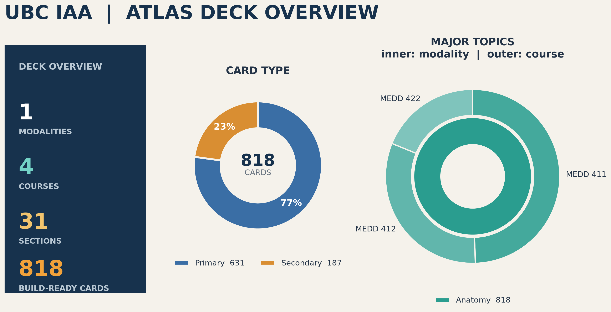

# UBC Integrated Anatomy Atlas (UBC IAA)



## Introduction

The UBC Integrated Anatomy Atlas (UBC IAA) is a student-led educational resource developed in collaboration with UBC faculty to support learning throughout the preclinical MD curriculum. The project combines high-quality images with curriculum-aligned questions to create a standardized study resource available in multiple formats and in multiple topics.

This repository contains the automated pipeline used to generate the UBC IAA
Anki deck and project progress report across anatomy and future atlas modalities (radiology, dermatology, ophthalmology).

By centralizing content generation, contributors can update course spreadsheets and images once, then automatically regenerate every learning resource. This reduces manual work, improves consistency, and simplifies maintenance as the atlas continues to expand.

## For users

[Download the latest UBC IAA Anki deck](https://drive.google.com/drive/folders/16NqVKhlYowYreh6T2Xh8ZqJlWgYB9zbg?usp=sharing).

### Which Anki file should I download?

An `.apkg` file is a package that you open in Anki to import its cards and
images.

The UBC IAA covers four subjects: Anatomy, Radiology, Dermatology, and
Ophthalmology. Currently, only the complete atlas and Anatomy packages are
available. Radiology, Dermatology, and Ophthalmology are under construction
and cannot yet be downloaded.

| File | What it contains | Who should use it |
| --- | --- | --- |
| `UBC-IAA-all.apkg` | Every subject and course currently available in the UBC IAA. | Recommended for students who want the complete atlas. |
| `UBC-IAA-anatomy.apkg` | All available Anatomy courses and cards. | Students who only want Anatomy or need a smaller download. |
| `UBC-IAA-radio.apkg` | **Under construction.** This will contain Radiology courses and cards. | Not yet available. |
| `UBC-IAA-derm.apkg` | **Under construction.** This will contain Dermatology courses and cards. | Not yet available. |
| `UBC-IAA-ophtho.apkg` | **Under construction.** This will contain Ophthalmology courses and cards. | Not yet available. |

The word `all` means the complete atlas. A subject name such as `anatomy`
means that the file contains only that subject.

Every package uses the same card identifiers and internal deck structure:

```text
UBC-IAA
└── Anatomy
    └── MEDD 411
        └── Lab 2 Spine
            ├── Primary
            └── Secondary
```

This makes the packages interoperable. For example, you can import
`UBC-IAA-anatomy.apkg` now and later import `UBC-IAA-all.apkg`; Anki updates
the shared cards instead of creating a second copy.

Updates are not installed automatically. Download and import the newest
version of your chosen package whenever a new release is available.

## For contributors

Read [CONTRIBUTING.md](CONTRIBUTING.md) before editing course spreadsheets or
adding images. It explains the folder structure, required spreadsheet columns,
image naming, card tags, and review workflow.

After updating the source material, use the technical instructions below to
rebuild the deck and project-status image.

## Technical setup

Install Python 3.12, then open the project folder in a terminal. The build
script creates and configures `.venv`, installs the required packages, builds
the Anki deck, and regenerates the project-status image.

When the instructions show a command in a box, copy the command, paste it into
the terminal, and press Enter. Wait for the terminal prompt to return before
entering the next command. Do not type the word `bash` or `powershell` shown
above a command box.

### Step 1: Install Python

Download and install Python 3.12 from
[python.org/downloads](https://www.python.org/downloads/). On Windows, select
**Add Python to PATH** during installation and install Git for Windows so that
Git Bash is available.

### Step 2: Open the project folder in a terminal

First, find the downloaded `UBC_IAA_pipeline` folder on your computer. If it was
downloaded as a ZIP file, extract the ZIP before continuing.

**Windows**

1. Open the `UBC_IAA_pipeline` folder in File Explorer.
2. Right-click an empty area inside the folder.
3. Select **Open Git Bash here**.

**macOS or Linux**

1. Open the Terminal application.
2. Type `cd `, including the space after `cd`.
3. Drag the `UBC_IAA_pipeline` folder from Finder or your file manager into the
   Terminal window.
4. Press Enter.

The terminal is now open in the project folder. Leave it open for all remaining
steps.

### Step 3: Build everything

Copy, paste, and run:

```bash
./run_all.sh
```

If the existing `.venv` is broken or uses another Python version, the script
moves it to a timestamped `.venv.incompatible.*` backup and creates a clean
Python 3.12 environment. When the build finishes, the project folder will
contain `UBC-IAA-all.apkg`, one `UBC-IAA-<modality>.apkg` subset for each
available drive, `error.csv`, and `project_status.png`.

## Optional technical commands

### Regenerate the project-status image

```bash
.venv/bin/python generate_project_status.py
```

`run_all.sh` is the supported entrypoint for all builds.
